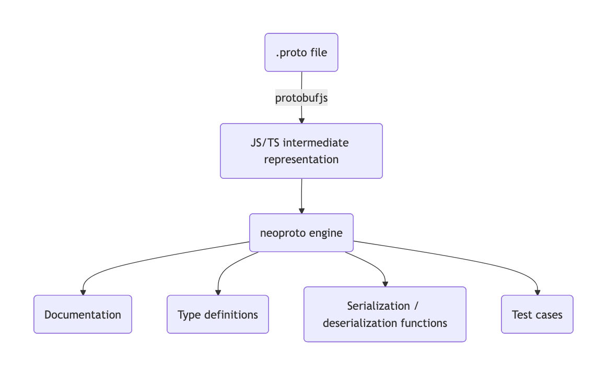

# neoproto

`neoproto` is a code generation tool that focuses on improving the developer experience of working with protobuf messages in TypeScript. It generates usable type definitions, serialization and deserialization functions, and test cases for protobuf messages defined in `.proto` files. The goal is to produce an idiomatic TypeScript API that abstracts away the idiosyncrasies of protobuf as much as possible.

> This tool is in early development. It may contain bugs and may not support all features of protobuf. Use at your own risk.

### Features

All `neoproto` needs is a `.proto` file. It does all the work from there by parsing the file using [protobufjs](https://www.npmjs.com/package/protobufjs-cli) to generate an intermediate representation of the protobuf schema, and then converts that representation into a usable TypeScript API.



### Usage

`neoproto` is designed to be used as a command-line tool. Install it as a dev dependency in your project:

```bash
npm install --save-dev neoproto
```

Then, you can run it from the command line:

```bash
npx neoproto -p path/to/your/file.proto -o path/to/output/directory -t path/to/test/directory
```

### Limitations

This is a strongly opinionated library that makes certain assumptions about how protobuf messages are defined and used. It is not a general-purpose library. You may find it helpful, or you may find that it does not fit your use case. In either case, please feel free to fork the library and modify it to suit your needs.

This project supports only a subset of the `proto2` syntax (messages and enums). `proto3` is not intended to be supported, although it may have some level of compatibility.

As defined in the [protobuf spec version 2](https://protobuf.dev/programming-guides/proto2/#default), the default values of fields are as follows:

| Type          | Default Value |
| ------------- | ------------- |
| string        | empty string  |
| bytes         | empty bytes   |
| bool          | false         |
| numeric types | zero          |
| enum          | first value   |

Given the above, there is no way to differentiate between a field that is set to its default value and a field that is not set at all. This can lead to ambiguity in certain cases, especially when dealing with optional fields. This library has taken the approach of treating all optional fields as if they were set to the default value. Ensure that your protobuf messages are designed with this in mind to avoid unintended consequences, and that usage of the library aligns with this behavior.
