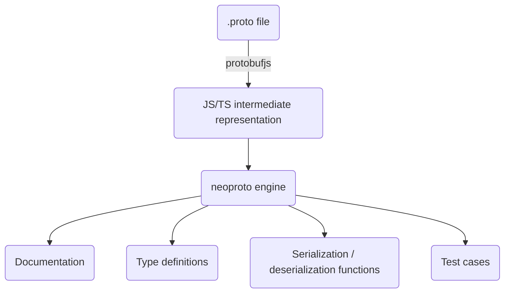

```mermaid
graph TD
    input(.proto file) -- protobufjs --> ir(JS/TS intermediate representation)
    ir --> neo(neoproto engine)
    neo --> H(Documentation)
    neo --> D(Type definitions)
    neo --> E(Serialization / deserialization functions)
    neo --> G(Test cases)
```
